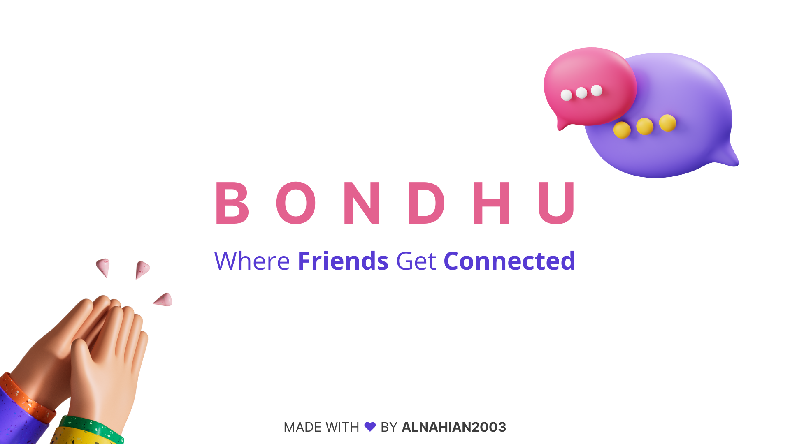
<h1>Bondhu — Where Friends Get Connected</h1>

  Bondhu is a simple social media platform to connect people around the world
  🌎. This is actually a practice project, probably a silly clone version of
  Facebook. Main objective of this project is to get handy with a MVC framework
  and learn how to work with it. This knowlege will help me later to work with
  Laravel or any other PHP framework, that follows MVC pattern.
   
  <a
    href="https://github.com/alnahian2003/alanmvc"
    title="Alan MVC PHP Framework"
    >AlanMVC</a
  >
  is the core of this platform. AlanMVC is a micro MVC PHP framework. Both
  'Bondhu' & 'AlanMVC' is made with ❤ by
  <a href="https://alnahian2003.github.io">alnahian2003</a>

<section>
<h5>NOTE: Upload "bondhu.sql" to your PhpMyAdmin or MySQL db and then Check config folder and update with your preferred data ⚠</h5>
<ul>
Demo user's login credentials are username: 
<ol>
    Al Nahian
    <li>Username: alnahian2003</li>
    <li>Password: password</li>
</ol>

<ol>
    Dwight K Schrute
    <li>Username: dwight</li>
    <li>Password: password</li>
</ol>
</ul>
</section>

<section>
<h3>Features</h3>

    <h4>New User/Account Related</h4>
        <input type="checkbox" disabled checked> Create New Account
         
        <input type="checkbox" disabled checked> Login To An Existing Account
         
        <input type="checkbox" disabled> Resetting User Password
         
        <input type="checkbox" disabled> Forget Password
         
        <input type="checkbox" disabled> Deleting a User Account

    <h4>Newsfeed & Post Related</h4>
            <input type="checkbox" disabled checked> Newsfeed Section
             
            <input type="checkbox" disabled checked> View Full Post Page
             
            <input type="checkbox" disabled checked> Create a Post
             
            <input type="checkbox" disabled checked> Edit a Post
             
            <input type="checkbox" disabled checked> Delete a Post
             
            <input type="checkbox" disabled checked> Upload a Post Image
             
            <input type="checkbox" disabled checked> Attach a Video URL from <strong>YouTube</strong>
             
            <input type="checkbox" disabled> Upload a Post Image
             
            <input type="checkbox" disabled> Like a Post
             
            <input type="checkbox" disabled> Comment on a Post
             
            <input type="checkbox" disabled> Share a Post

    <h4>Profile Related</h4>
            <input type="checkbox" disabled checked> Personal Profile Page
             
            <input type="checkbox" disabled checked> Other Users Profile Page
             
            <input type="checkbox" disabled checked> Profile Image
             
            <input type="checkbox" disabled checked> Cover Image
             
            <input type="checkbox" disabled checked> Edit Profile
             
            <input type="checkbox" disabled checked> Change Profile Image
             
            <input type="checkbox" disabled checked> Change Cover Image
             
            <input type="checkbox" disabled checked> Update About Details
             

</section>

<section>
  <h2>Project Screenshots</h2>
  <figure>
    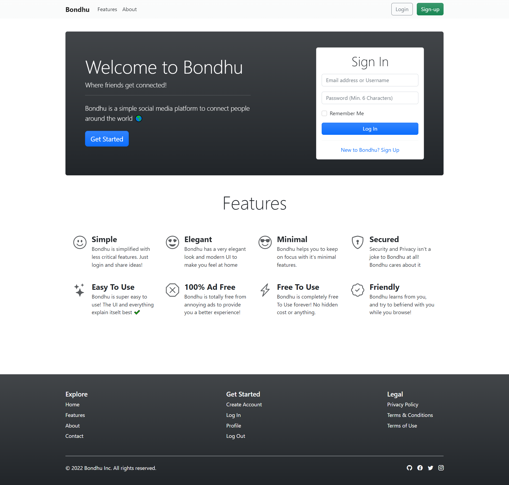
    <figcaption>Home Page</figcaption>
  </figure>

  <figure>
    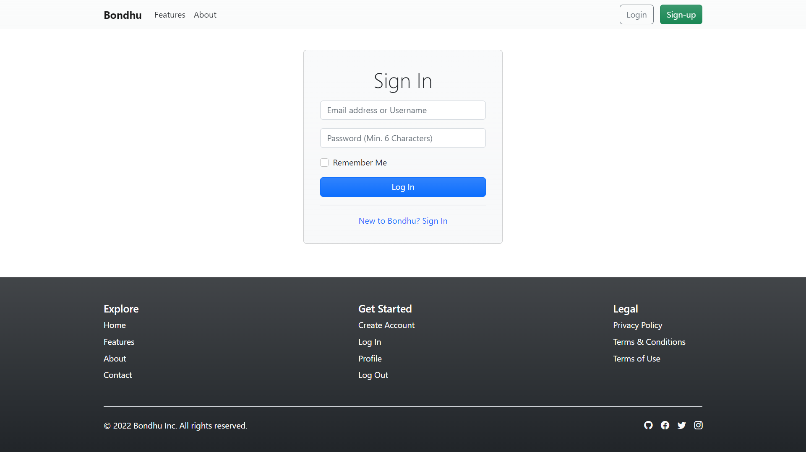
    <figcaption>Login Page</figcaption>
  </figure>

  <figure>
    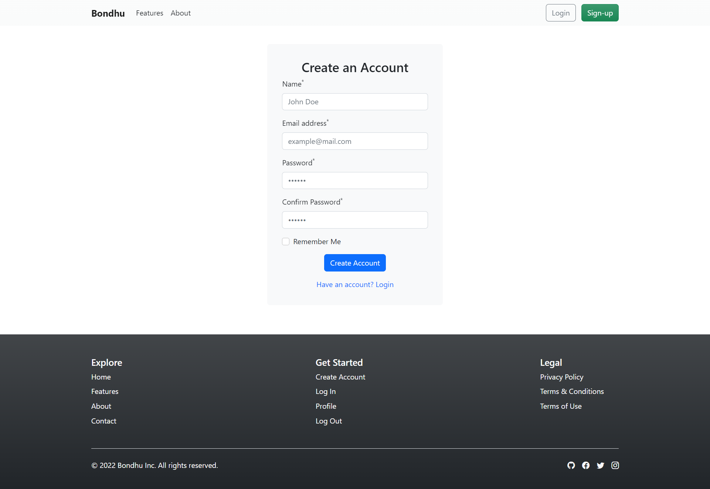
    <figcaption>Create a New Account Page</figcaption>
  </figure>

  <figure>
    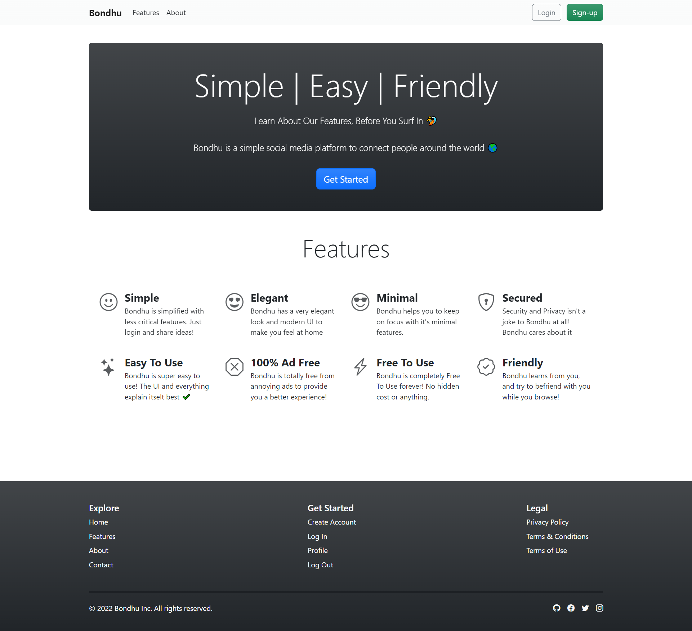
    <figcaption>Features Page</figcaption>
  </figure>

  <figure>
    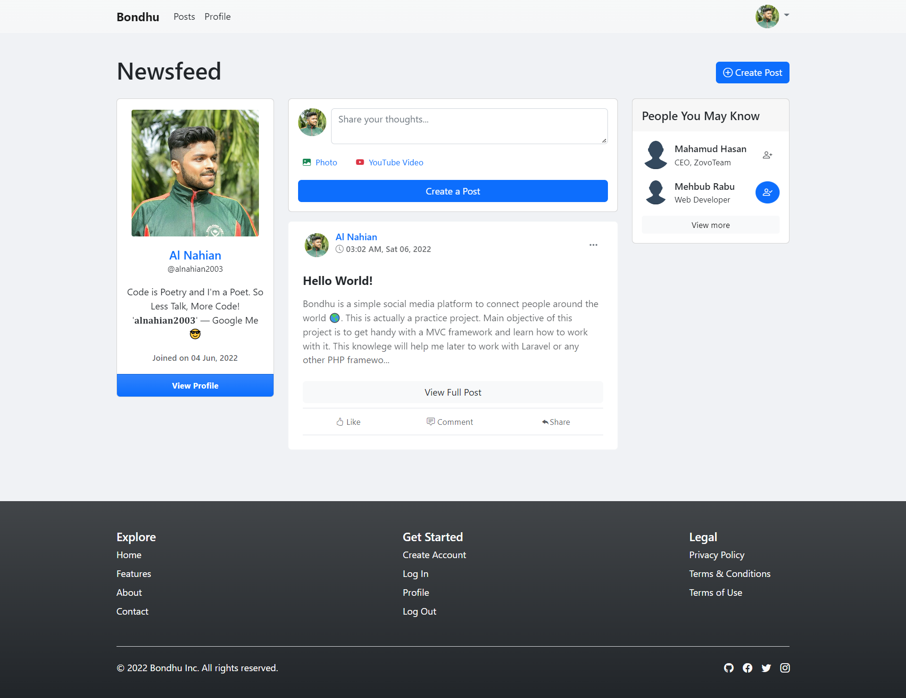
    <figcaption>Newsfeed Example 1</figcaption>
  </figure>

  <figure>
    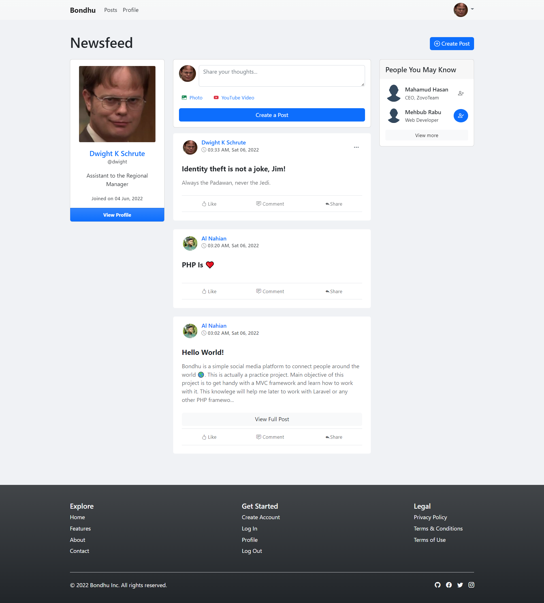
    <figcaption>Newsfeed Example 2</figcaption>
  </figure>

  <figure>
    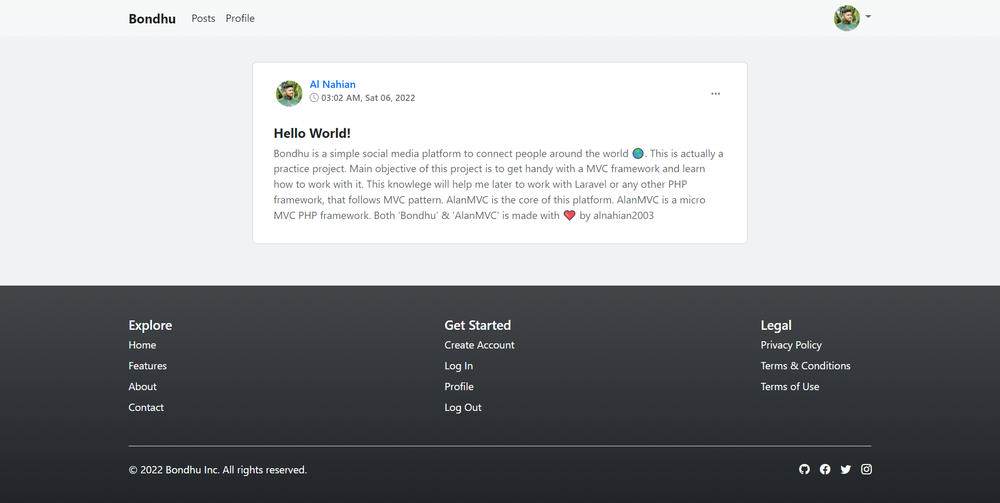
    <figcaption>View Full Post Page</figcaption>
  </figure>

  <figure>
    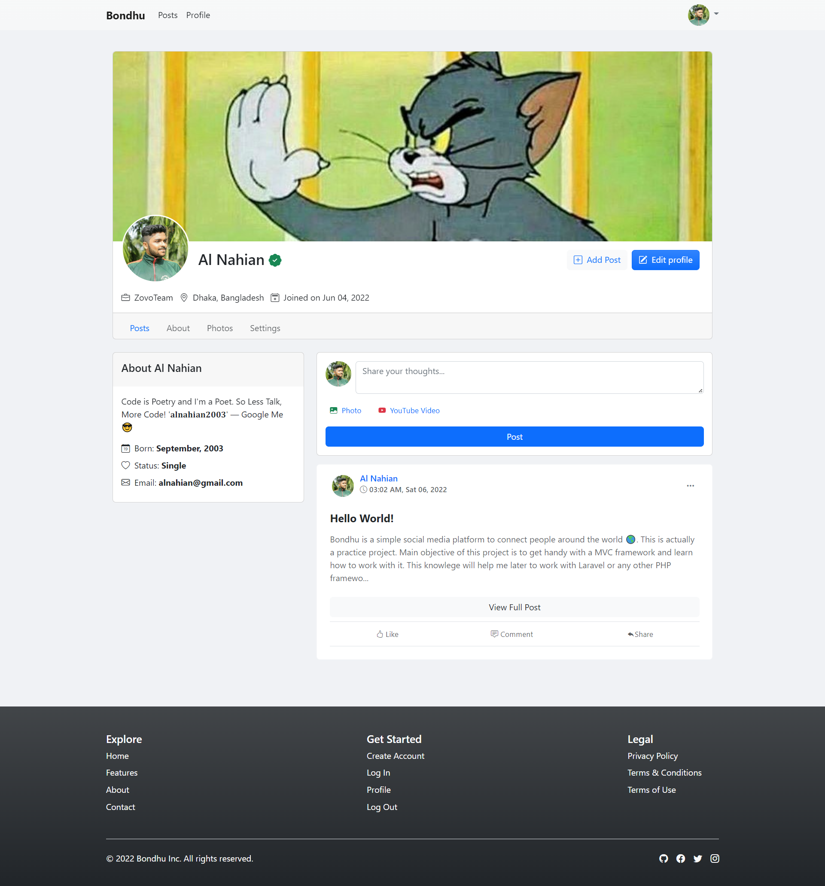
    <figcaption>Profile Page</figcaption>
  </figure>

  <figure>
    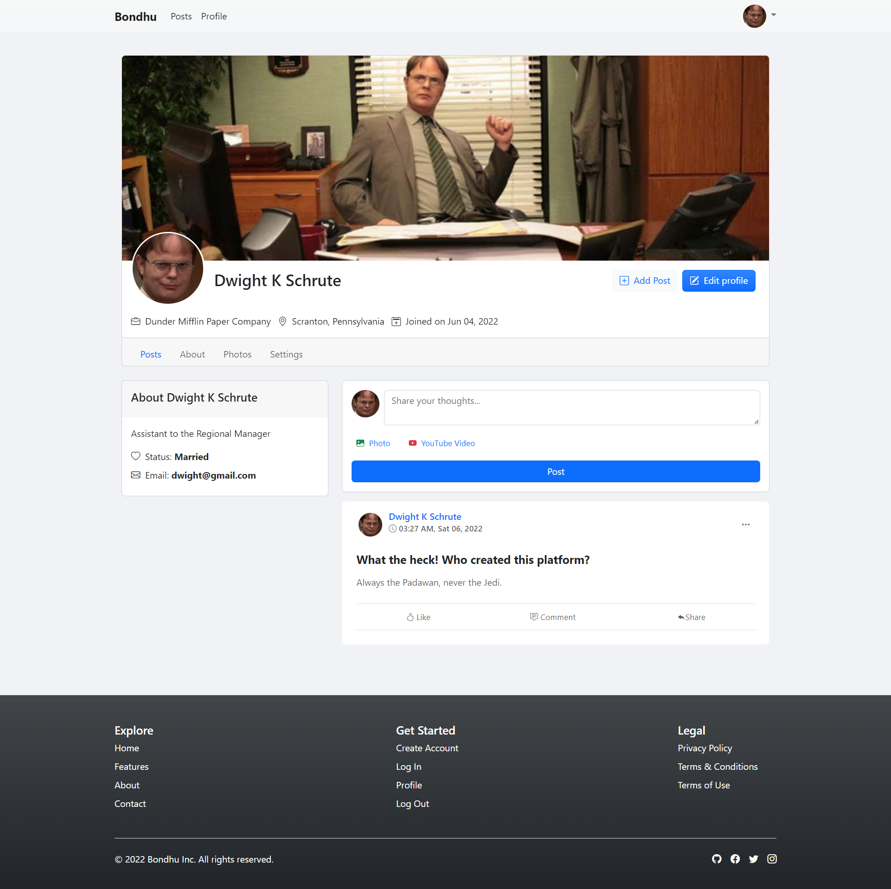
    <figcaption>Profile Page 2</figcaption>
  </figure>

  <figure>
    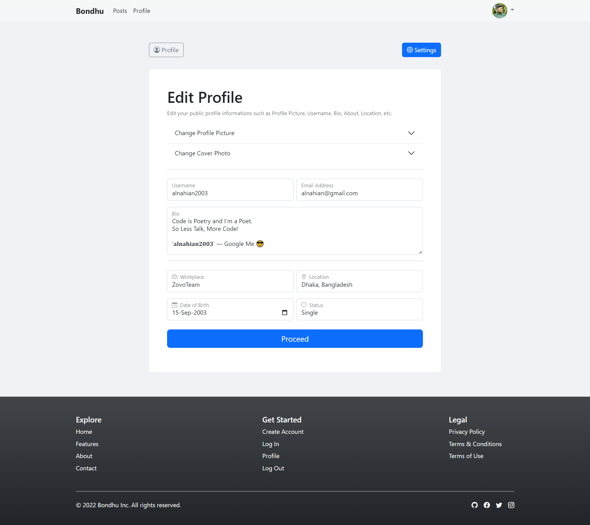
    <figcaption>Edit Profile Page</figcaption>
  </figure>

  <figure>
    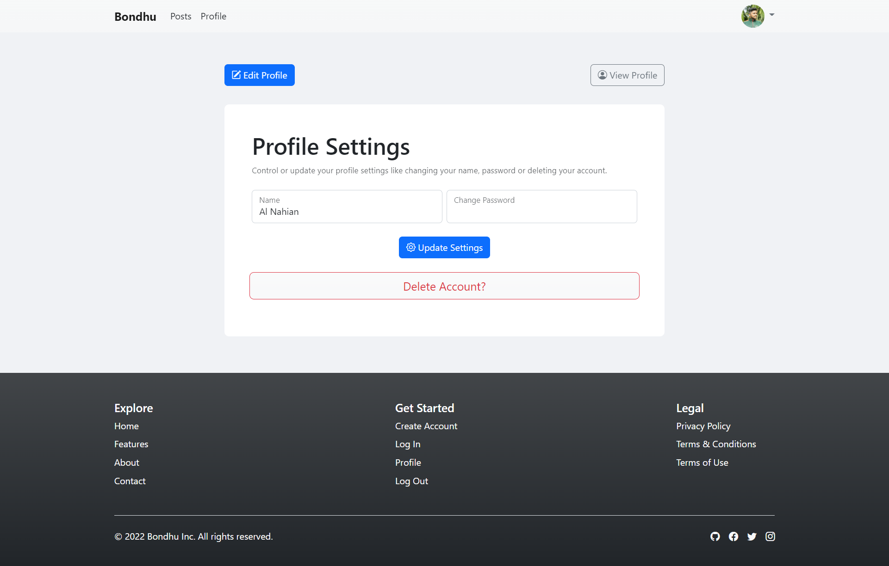
    <figcaption>Settings Page</figcaption>
  </figure>
</section>

<section>
  <h3>Core Techs:</h3>
  <ul>
    Front End:
    <li>HTML</li>
    <li>CSS</li>
    <li>Bootstrap 5.2</li>
    <li>a little bit JavaScript</li>
  </ul>

   

  <ul>
    Back End:
    <li>Core PHP</li>
    <li>AlanMVC (Made by me)</li>
    <li>MySQL</li>
  </ul>
</section>

<section>
  <h2>Final Note - 2:56 AM, 04 June, 2022</h2>
  

    Almost every basic functionalites implementation has been completed, except
    Some features like, Post Image Upload, Functional Settings Page, and a few
    little things.
     
    Maybe Someday, I'll spend some time implement that feature later.
  

  

    I have been following Brad Traversy's Udemy course to build some kinda PHP
    MVC framework and build a project on that. Since the last week, I worked so
    hard and I was honestly dedicated to it. Now I'm kinda tired and bored to
    work with this project anymore. By the way, that was very first time in my
    life that I ever put some effort on project like this. It was really fun
    learning all these interesting things.
     
    <strong>Thank You Dear Mentor, BRAD TRAVERSY 💚</strong>
  

</section>

<h4>Made With ❤ By alnahian2003</h4>

